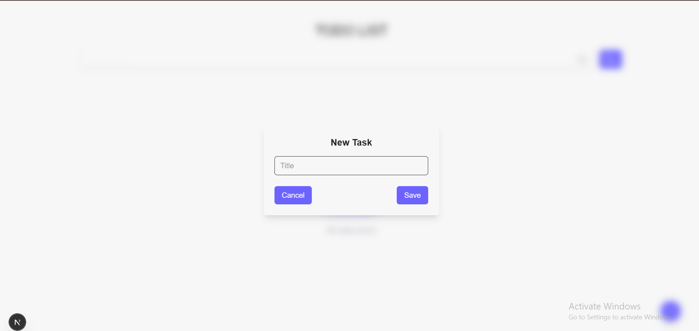

Here’s the full **README.md code** you can copy into your project:

````markdown
# 📝 Simple ToDo App  

## 🎥 Demo

<video 
  src="https://raw.githubusercontent.com/ZAYATY-260/todolist/master/public/demo.mp4" 
  controls 
  width="600"
>
  Your browser does not support the video tag.
</video>

A simple and modern ToDo List application built with **Next.js 14**, inspired by [this Figma design](https://www.figma.com/design/zTBZrZLYmAFIVjAijOJFpW/Simple-ToDo-List-Design--Community-?node-id=214-5&t=OzZb19z5oIq7RT9v-0).  
Easily manage your tasks with add, edit, delete, search, and filter features — with **localStorage persistence**.  

---

## ✨ Features  

- ✅ Add new tasks with title & description  
- ✅ Edit or delete tasks  
- ✅ Mark tasks as complete (line-through)  
- ✅ Search tasks by title   
- ✅ Light/Dark theme toggle 🌙☀️  
- ✅ Tasks saved in **localStorage**  

---

## 🚀 Getting Started  

### 1️⃣ Clone the repo  
```bash
git clone https://github.com/your-username/todo-app.git
cd todo-app
````

### 2️⃣ Install dependencies

```bash
npm install
# or
yarn install
# or
pnpm install
# or
bun install
```

### 3️⃣ Run the development server

```bash
npm run dev
# or
yarn dev
# or
pnpm dev
# or
bun dev
```

### 4️⃣ Open in browser

Go to 👉 [http://localhost:3000](http://localhost:3000)

---

## 🖼️ Screenshots

> 💡 Add screenshots of your app here once it’s running. Example:

* **Home Page**
  

* **Add Task Modal**
  

* **Figma Design**
  

  
---

## 🛠️ Built With

* [Next.js](https://nextjs.org/) – React Framework
* [Tailwind CSS](https://tailwindcss.com/) – Styling
* [Lucide Icons](https://lucide.dev/) – Icons
* LocalStorage – Data persistence

---

## 📦 Deployment

The easiest way to deploy is with **Vercel** (from the creators of Next.js).

[](https://vercel.com/new?utm_medium=default-template&filter=next.js&utm_source=create-next-app&utm_campaign=create-next-app-readme)

---

## 📚 Learn More

* [Next.js Documentation](https://nextjs.org/docs)
* [Learn Next.js](https://nextjs.org/learn)

---

## 👨‍💻 Author

Made with ❤️ by **Zeyad Zayaty**


